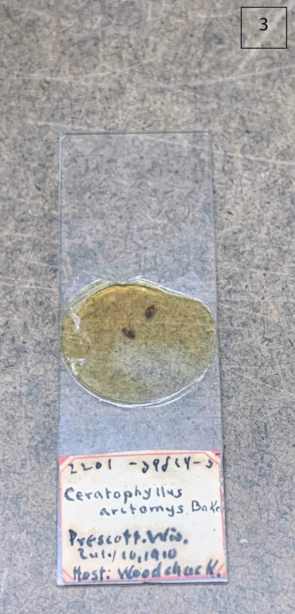
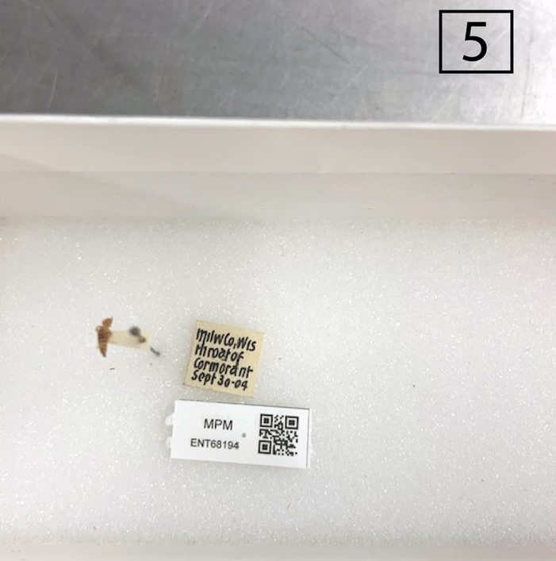

### Objectives
-----
> The goal of this exersise is to transcribe the association data from the label images provided and consider not just how you would interpret and classify an interaction, but how someone else may interpret the interaction.

### Getting started
---------------------------------
> Download a copy of the activity spreadsheet to fill in, or open and make a copy you can edit in Google Drive or Google Sheets. 
> * [Excel sheet (.xlsx)](../files/1-%20Individual%20Transcription%20Interactions%20Worksheet.xlsx?raw=true)
>  * [Comma delimited (.csv)](../files/1-%20Individual%20Transcription%20Interactions%20Worksheet%20-%20Sheet1.csv)
>  * [Google Spreadsheet (make copy or download)](https://docs.google.com/spreadsheets/d/1Avs_gVdz7Dg8KK4AsUzLTed9Lx3bz8grdxfq6ocqJlI/edit?usp=sharing)

> Transcribe the association data from each of the 7 specimen labels provided below into your spreadsheet. You can also open the images up in separate windows or tabs if you prefer with these links:
> * [Specimen 1](../fig/Specimen_transcription_01.jpg) 
> * [Specimen 2](../fig/Specimen_transcription_02.jpg)
> * [Specimen 3](../fig/Specimen_transcription_03.jpg) 
> * [Specimen 4](../fig/Specimen_transcription_04.jpg) 
> * [Specimen 5](../fig/Specimen_transcription_05.jpg) 
> * [Specimen 6](../fig/Specimen_transcription_06.jpg) 
> * [Specimen 7](../fig/Specimen_transcription_07.jpg)

### Specimen Images
---------------------------------
> There are 7 different specimen label images with association data to transcribe. 
> Pick the worksheet format above best for you and transcribe the association data into the worksheet. 

> ## `Specimen 1: Transcribe assocation data from label image`
>
> Fill in all columns of the worksheet as appropriate. 
> 
> 
> Photo courtesy of: [The Field Museum of Natural History Insect Collection](https://www.fieldmuseum.org/science/research/area/insects-arachnids-and-myriapods) 
>
{: .challenge}

> ## `Specimen 2: Transcribe assocation data from label image`
>
> Fill in all columns of the worksheet as appropriate. 
> 
> 
> Photo courtesy of: 
>
{: .challenge}

> ## `Specimen 3: Transcribe assocation data from label image`
>
> Fill in all columns of the worksheet as appropriate. 
> 
> 
> Photo courtesy of: 
>
{: .challenge}

> ## `Specimen 4: Transcribe assocation data from label image`
>
> Fill in all columns of the worksheet as appropriate. 
> 
> 
> Photo courtesy of: 
>
{: .challenge}

> ## `Specimen 5: Transcribe assocation data from label image`
>
> Fill in all columns of the worksheet as appropriate. 
> 
> 
> Photo courtesy of: [Milwaukee Public Museum Invertebrate Zoology Collection](https://www.mpm.edu/index.php/research-collections/zoology/invertebrate-zoology/collections-overview)
>
{: .challenge}

> ## `Specimen 6: Transcribe assocation data from label image`
>
> Fill in all columns of the worksheet as appropriate. 
> 
> 
> Photo courtesy of: 
>
{: .challenge}

> ## `Specimen 7: Transcribe assocation data from label image`
>
> Fill in all columns of the worksheet as appropriate. 
> 
> 
> Photo courtesy of: [The Field Museum of Natural History Insect Collection](https://www.fieldmuseum.org/science/research/area/insects-arachnids-and-myriapods)
>
{: .challenge}

  

# Word Cloud! (SESSION 1)
---------------------------------
One fun way to visualize results and find common terms is by creating a word cloud.

> ## `Share your interaction terms!`
> ➡️ Go to: [https://www.menti.com/als8cx2muj1n](https://www.menti.com/als8cx2muj1n)
>   * Alternatively, go to [www.menti.com](https://www.menti.com/) and enter the code **3506 6926** (do not enter the 12 34 56 given below - this asks you about super heros - something for another time)
>   
> ➡️ Enter the different interaction terms you used for each specimen. 
>
> See the word cloud results in real time as everyone submits terms! 
> 
> 
<iframe sandbox='allow-scripts allow-same-origin' allowfullscreen='true' allowtransparency='true' frameborder='0' height='315' src='https://www.mentimeter.com/app/presentation/alkrrxjj2u56a658567mx1rprv89kc2s/embed' style='position: absolute; top: 0; left: 0; width: 100%; height: 100%;' width='420'></iframe>

> 
> Live results can also be viewed [here (https://bit.ly/ECMcloud1)](https://bit.ly/ECMcloud1).
> 
{: .callout}

  

# Word Cloud! (SESSION 2)
---------------------------------
One fun way to visualize results and find common terms is by creating a word cloud.

> ## `Share your interaction terms!`
> ➡️ Go to: [https://www.menti.com/al6w6bo3q3hd](https://www.menti.com/al6w6bo3q3hd)
>   * Alternatively, go to [www.menti.com](https://www.menti.com/) and enter the code **7153 9451** (do not enter the 12 34 56 given below - this asks you about super heros - something for another time)
>   
> ➡️ Enter the different interaction terms you used for each specimen. 
>
> See the word cloud results in real time as everyone submits terms! 
> 
> 
<iframe sandbox='allow-scripts allow-same-origin' allowfullscreen='true' allowtransparency='true' frameborder='0' height='315' src='https://www.mentimeter.com/app/presentation/alrfprgvz289vo2216t4q7qu7opsye67/embed' style='position: absolute; top: 0; left: 0; width: 100%; height: 100%;' width='420'></iframe>

> 
> Live results can also be viewed [here (https://bit.ly/ECMcloud2)](https://bit.ly/ECMcloud2).
> 
{: .callout}


> ## `Import into a sqlite database`
---------------------------------
>Databases are a great way to manage large datasets and handle data filtering, sorting and grouping. Sqlite is commonly used with R as it is easily transferable with the R code. We are not going to learn sqlite today, but there are some great Carpentries tutorials to get you started, including the [Introduction to sqlite](https://swcarpentry.github.io/sql-novice-survey/). Let's step through a few commands to see how easy it is to take a CSV file and create a sqlite database.
{: .callout}

~~~
sqlite3 globi.db

.mode csv

.import Ixodes_data_unique.csv interactions

PRAGMA table_info(interactions);

SELECT sourceTaxonGenusName, count(sourceTaxonGenusName) FROM interactions group by sourceTaxonGenusName;

SELECT interactionTypeName, count(interactionTypeName) FROM interactions group by interactionTypeName;

.exit
~~~


## Next Up: Small Group Data Transcriptions

  <a href="../04-small-group/index.html">
    <button type="button" class="btn btn-info"> Small Group Data Transcriptions (Worksheet Activity) </button>
  </a>

