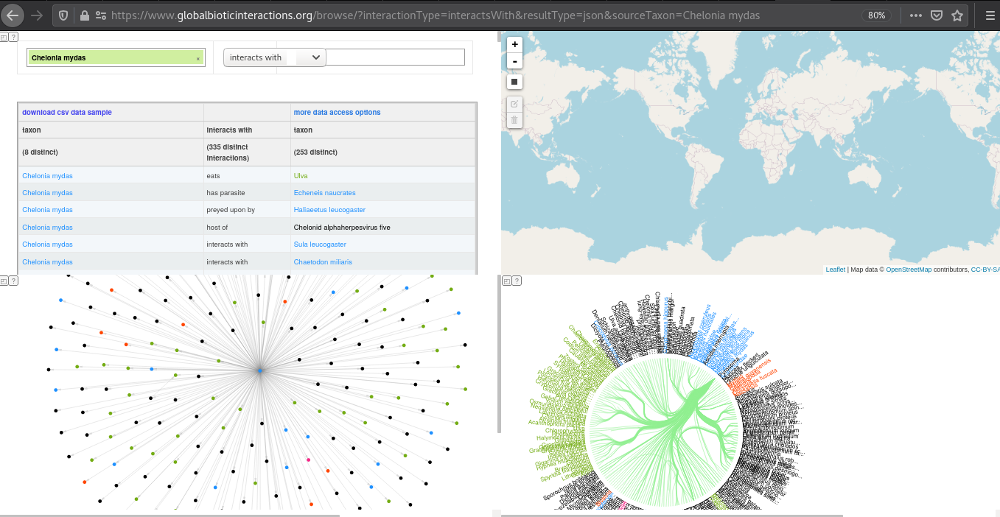



Global Biotic Interactions offers help to explore available species interaction datasets using basic web tools. These webtools help to answer questions like: "Which organisms do Ixodes interact with?", "Which datasets support describe Ixodes interactions?", and "How can I suggest improvements or point out suspicious data?"

## Interaction Search 

The web page at [https://globalbioticinteractions.org](https://globalbioticinteractions.org) helps search for specific interactions by (taxonomic) name, interaction type (e.g., eats, parasite of, pollinates), and data source. Similar to general purpose search engines, only a subset of matching results is shown, and more can be requested if desired. The results include a description of the interacting taxa as well as the authority and data source that is said to support (or refute!) the interaction claim. 

> ## `Exercise 1. Searching for interactions` 
>
> Use GloBI's interaction search page to:
>
> - first, search for interactions that involve ticks (Ixodes)
> - then, narrow to search to include only tick (Ixodes) - mammal (Mammalia) interactions
> - finally, select only *parasitic* tick-mammal interactions 
>
> For each of the narrowing search, describe some of the data sources and references. What kind of references are they? Which data sources support the interaction claims?
> 
{: .challenge}

## Context of Interaction Results

Now that we've explored ways to select specific questions, let's have a closer look at the links embedded in the search results. One of the goals of the web search tool is to provide a minimal, easy to use, way to get a sense of the wealth of interaction data that is already openly available. 

> ## `Exercise 2. A closer look at interaction search results` 
>
> 1. Various icons and links appear in search results. Make screenshots of the some search result and describe what these icons and links do. 
>
> 2. Various verbs (e.g., interacts with, parasite of) are used to categorize interactions. List a few of these verbs (aka interactions terms) and describe what you think they mean in your own words. Compare the description with the web resources the verbs link to. 
>
> 3. Describe how you imagine your colleagues would use the species interaction search web tool. Discuss current limitations and improvement opportunities.
>
{: .challenge}

### Point-and-click Tool 2: Interaction Browser

Another search tool, the interaction browser, can be found at [https://globalbioticinteractions.org/browse](https://globalbioticinteractions.org/browse). This tools uses network and bundle diagrams to help visualize a sample of the selected interaction data. Also, a geospatial constraints can be specified to select a specific area of interest. Finally, a sample csv file with supporting interaction data records can be downloaded for review. 

> ## `Exercise 3. A more visual exploration of interaction data` 
>
> First, open the [GloBI Browser](https://globalbioticinteractions.org/browse). By default, interactions of the green turtle (_Chelonia mydas_) are shown. It should look something like:
> 
>
> Now, familiarize yourself with the four panels by clicking around and exploring their interactive features:
>   - Can you update the search criteria to only select tick (Ixodes) - mammal (Mammalia) interactions? 
>   - What happens when you select only North America in the geospatial selector? 
>   - How would you share your resulting diagram with others? 
>
>
> Finally, click on the "download csv data sample" to download the related interactions.csv file. 
>
> Open the interactions csv file in your favorite editor and describe each of the columns in your own words. Which columns need further explanation?
> 
> (Extra Credit) Make a list of all the distinct mammalian hosts and Ixodes names that were included in the csv sample. 
>
{: .challenge}

