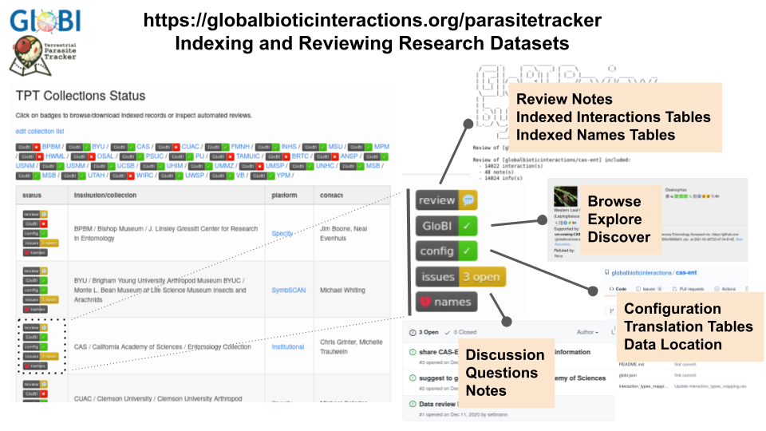

## Objectives

Each small group will summarize their discussion and share key points and conclusions with the whole group. Once each group has had a chance to share, the whole group will discuss similar and dissimilar findings between the different groups.

A list of GloBI data sources can be found at [https://globalbioticinteractions.org/sources](https://globalbioticinteractions.org/sources). 





> ## `Exercise 1: Report your group's findings`
> 
> Appoint a spokesperson to share your group's results.
> 
> What association terms did you group use or need to create for specimen 1?
> * Did all of your group agree? Why or why not?
> * Did you need to create a new association term or field?
> 
> What association terms did you group use or need to create for specimen 2?
> * Did all of your group agree? Why or why not?
> * Did you need to create a new association term or field?
> 
> What association terms did you group use or need to create for specimen 3?
> * Did all of your group agree? Why or why not?
> * Did you need to create a new association term or field?
>
> What association terms did you group use or need to create for specimen 4?
> * Did all of your group agree? Why or why not?
> * Did you need to create a new association term or field?
> 
> What association terms did you group use or need to create for specimen 5?
> * Did all of your group agree? Why or why not?
> * Did you need to create a new association term or field?
> 
> What association terms did you group use or need to create for specimen 6?
> * Did all of your group agree? Why or why not?
> * Did you need to create a new association term or field?
> 
> What association terms did you group use or need to create for specimen 7?
> * Did all of your group agree? Why or why not?
> * Did you need to create a new association term or field?
> 
{: .challenge}

> ## `Exercise 2: Whole group discussion`
> 
> Question to think about:
>  * Do we need additional terms or fields in standard data collection methods/depositories?
>  * How does being a data provider vs data user change how we interpret the terms used with association data?
> 
{: .challenge}

> ## `Additional information`
> A full list of different [association terms, definitions, and translation tables](https://www.globalbioticinteractions.org/parasitetracker/) compiled so far are available below:
> > | Resource | Description |
> > |----------|-------------|
> > | [OBO Relations Ontology project page](http://obofoundry.org/ontology/ro.html) | OBO RO contains many kinds of terms, not just biotic associations terms |
> > | {List of OBO RO Biotic Interaction Terms with definitions](https://github.com/globalbioticinteractions/nomer/blob/main/nomer/src/test/resources/org/globalbioticinteractions/nomer/match/ro.tsv) | a table of RO biotic interaction terms and their definitions (if available) |
> > | [List of GloBI Supported Interaction Terms](https://github.com/globalbioticinteractions/globalbioticinteractions/blob/main/eol-globi-lib/src/main/resources/org/globalbioticinteractions/interaction_types_ro.csv) | subset of RO interactions terms that GloBI uses for indexing |
> > | [Default Verbatim Terms Translation Table](https://github.com/globalbioticinteractions/globalbioticinteractions/blob/main/eol-globi-lib/src/main/resources/org/globalbioticinteractions/interaction_types_mapping.csv) | the translation table used by GloBI to maps verbatim interaction terms to supported interaction terms |
> > | [Example of Custom Verbatim Terms Translation Table](https://github.com/globalbioticinteractions/inhs-insects/blob/main/interaction_types_mapping.csv) | if provided/needed, GloBI can use a custom mapping provided by a collection
{: .callout}


GloBI builds the search index in the following steps:

1. **F**ind registered interaction data in Github and Zenodo. 
2. **A**ccess/download and version digital dataset 
3. **I**ntegrate interaction records using translation tables into a knowledge graph
4. allow for **R**euse by publishing integrated data products and services

These steps are repeated regularly, often many times a week, to include new additions or other updates. 

> ## `Want to Learn More about Data Indexing Steps?`
> Visit [https://globalbioticinteractions.org/process](https://globalbioticinteractions.org/process) and learn more about the GloBI indexing process and the tools. 
{: .callout}

## Data Source Reviews

To help better understand how GloBI interprets data sources, automated data reviews are made available for each data source, or dataset. 

These dataset specific reviews include:

- lists of review notes and summaries (e.g., review.tsv files), 
- checklists of taxonomic names (e.g., indexed-names.tsv), and
- indexed interaction data records (e.g., indexed-interactions.tsv). 

> ## `Exercise 2: Parasite Tracker Data Source: CAS`
> Visit the GloBI's Parasite Tracker project page at [https://globalbioticinteractions.org/parasitetracker](https://globalbioticinteractions.org/parasitetracker#CAS) and locate the **California Academy of Sciences / Entomology Collection**. 
>
> Click on each of the buttons and describe the function of the "review", "GloBI", "config", "issues" and "names" badges. 
>
> Also, in the review log, note how many interactions GloBI found in the California Academy of Sciences Entomology collection.
{: .challenge}

In this lesson episode, you've learned that GloBI is a search index that helps to explore interaction data in existing data sources. 

Also, you found the list of GloBI data sources and discovered the search-by-datasource, review and configuration links.



## Next Up: Sumbit your worksheets

  <a href="https://www.globalbioticinteractions.org/ecm-workshop/06-submit-your-worksheets/index.html">
    <button type="button" class="btn btn-info"> Submit your worksheets </button>
  </a>

  

