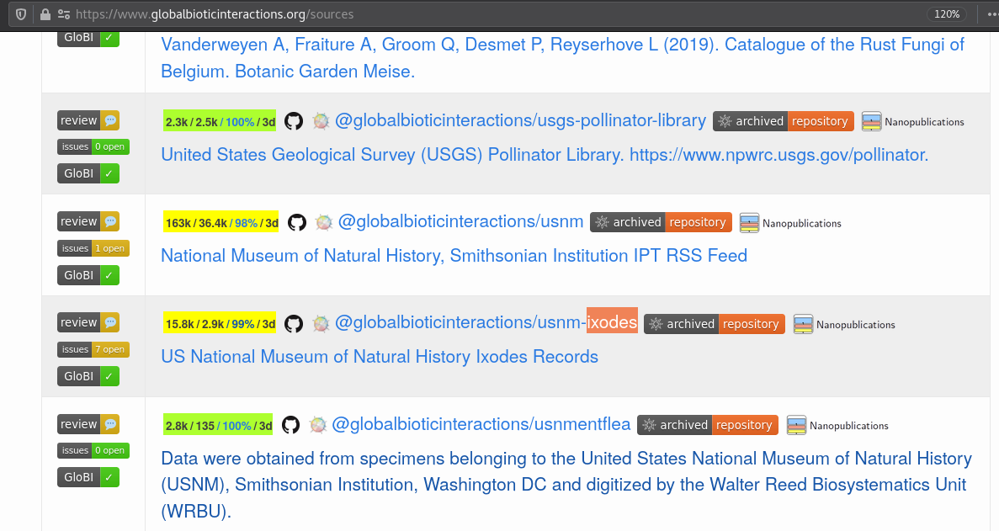
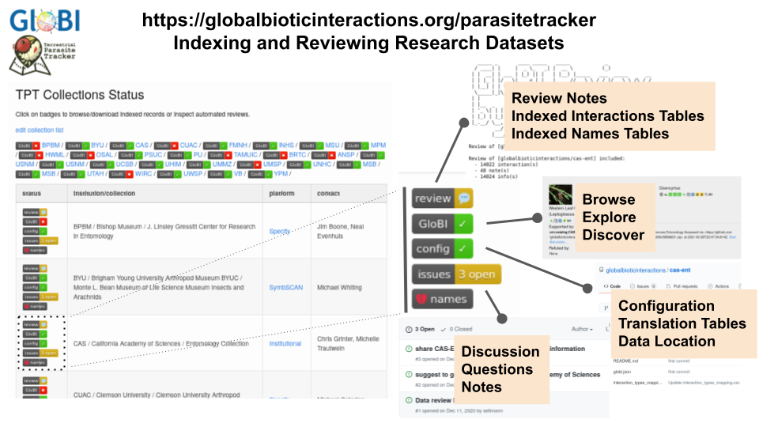

## Data Sources: GloBI's Building Blocks

Global Biotic Interactions ([https://globalbioticinteractions.org](https://globalbioticinteractions.org), GloBI) relies on existing species interaction datasets, or data sources. These data sources are regularly re-indexed by GloBI to include recent updates. So, rather than a data management system or repository, GloBI is more like a search engine that helps find biotic interaction data in openly available datasets.

The kinds of data sources indexed by GloBI are pretty diverse: some datasets come from professionally managed natural history collections or specialized data portals, whereas others are manually transcribe interaction records from literature, or observation records provided by citizen scientists. 

A list of GloBI data sources can be found at [https://globalbioticinteractions.org/sources](https://globalbioticinteractions.org/sources). 

> ## `Exercise 1: Find Data Sources`
> Visit [https://globalbioticinteractions.org/sources](https://globalbioticinteractions.org/sources) and locate:
>
>  - the **USNM Ixodes Collection**,
>
>  - Seltmann's **Tick Interaction Database**, and 
>
>  - **iNaturalist** observation records. 
>
> For each data source, click on the  badge to explore some of their indexed interactions. 
>
> Describe one interaction for each data source in the collaborative notes.
> 
{: .challenge}

GloBI builds the search index in the following steps:

1. **F**ind registered interaction data in Github and Zenodo. 
2. **A**ccess/download and version digital dataset 
3. **I**ntegrate interaction records using translation tables into a knowledge graph
4. allow for **R**euse by publishing integrated data products and services

These steps are repeated regularly, often many times a week, to include new additions or other updates. 

> ## `Want to Learn More about Data Indexing Steps?`
> Visit [https://globalbioticinteractions.org/process](https://globalbioticinteractions.org/process) and learn more about the GloBI indexing process and the tools. 
{: .callout}

## Data Source Reviews

To help better understand how GloBI interprets data sources, automated data reviews are made available for each data source, or dataset. 

These dataset specific reviews include:

- lists of review notes and summaries (e.g., review.tsv files), 
- checklists of taxonomic names (e.g., indexed-names.tsv), and
- indexed interaction data records (e.g., indexed-interactions.tsv). 

> ## `Exercise 2: Parasite Tracker Data Source: CAS`
> Visit the GloBI's Parasite Tracker project page at [https://globalbioticinteractions.org/parasitetracker](https://globalbioticinteractions.org/parasitetracker#CAS) and locate the **California Academy of Sciences / Entomology Collection**. 
>
> Click on each of the buttons and describe the function of the "review", "GloBI", "config", "issues" and "names" badges. 
>
> Also, in the review log, note how many interactions GloBI found in the California Academy of Sciences Entomology collection.
{: .challenge}

In this lesson episode, you've learned that GloBI is a search index that helps to explore interaction data in existing data sources. 

Also, you found the list of GloBI data sources and discovered the search-by-datasource, review and configuration links.

## Next Up: Reviewing the Reviews

If you'd like to learn more about what a data review is, please jump to [Reviewing Interaction Records](../07-reviewing-interaction-records). 

If you are specifically interested in how GloBI links to taxonomic names, please visit lesson episode [Reviewing Taxonomic Names](../06-reviewing-taxonomic-names).

