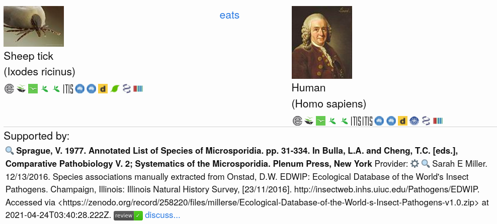



## Goal

The goal of this lesson is to understand how, and why, GloBI indexes and links taxonomic names. 

## Why Link Taxonomic Names?

Taxonomic names are used in literature and datasets to classify living organisms. To increase the discoverability of species interaction data, GloBI links and indexes provided taxonomic names to enable queries like: which mammals (Mammalia) are known the host ticks  (ticks)? Also, taxonomic name linking enables retrieval of key images and common names to help provide a context and make it easier to interpret an interaction claim.

## Taxonomic Name Linking Challenges
However, significant challenges exist to interpret and link taxonomic names, especially when dealing with datasets from different eras, authors, and disciplines.

These taxonomic name interpretation challenges include, but are not limited to:
1. Use of common names instead of scientific names (e.g., "kip" (Dutch) or "chicken" (English) vs. "Gallus gallus domesticus")
2. Typos (e.g., "Gall**v**s gallus" instead of "Gall**u**s gallus")
3. Ambiguous names (e.g., "Anura" is [a genus of flowering plants in the daisy family](https://en.wikipedia.org/wiki/Anura_(plant)) of as well as [an order for frogs](https://en.wikipedia.org/wiki/Anura_(frog))).
4. Outdates/ disputed names (e.g., taxonomic revisions re-interpret classifications and re-assign names)
5. Incomplete hierarchies (e.g., data sources provide species name, but no higher order taxonomic ranks)

## Taxonomic Name Links 

GloBI uses existing taxonomic name parsing and resolving tools to help find reasonable links between provided (or verbatim) names from data sources and existing taxonomic name lists. Rather than using a single taxonomic backbone, a variety of name sources is used. These name sources include, but are not limited to: [Integrated Taxonomic Information System (ITIS)](https://itis.gov), [World Register of Marine Species (WoRMS)](https://marinespecies.org), [NCBI Taxonomy](https://www.ncbi.nlm.nih.gov/taxonomy), [Wikidata Taxonomy](https://www.wikidata.org/wiki/Wikidata:WikiProject_Taxonomy), [Encyclopedia of Life (EOL) species pages](https://eol.org), [FishBase](http://fishbase.org), [SeaLifeBase](https://sealifebase.org), [iNaturalist Taxonomy](https://inaturalist.org/taxa), [GBIF Backbone Taxonomy](https://doi.org/10.15468/39omei), and [Plazi's TreatmentBank](http://plazi.org).

> ## `Exercise 1. Discover Taxonomic Links` 
>Note the icons representing the various taxonomic name schemes in the screenshot of an interaction claim of a sheep tick (_Ixodes ricinus_) eating a human (_Homo sapiens_). 
>
>Click on the image to try and reproduce the results. Then, discover the taxonomic linkages using the icons below the image. Note what project provides the images for the taxa. Also, record some examples of the urls pointing to the taxonomic name resources by right-clicking on the icon and copy-pasting link using "copy link location" (or similar). What do you notice?
>
>
>
>
{: .challenge}

## GloBI's Taxonomic Name Linking Process

The process to index and resolve taxonomic names currently consists of two phases.

### Phase 1. Create a Taxonomic Name Map (aka GloBI's Taxon Graph)

#### a. extract taxonomic names/ids from data sources
#### b. pre-process and parse names/ids 
#### c. match names/ids against existing names resolvers/name lists
#### d. version and publish (updated) taxon name map/graph

### Phase 2. Create Search Index

#### a. load specific version of taxon name map/graph
#### b. on encountering mapped taxonomic names/id, add to extra information index
#### c. on countering unmapped name/id, tag name with "no:match" 
#### d. version and publish interaction search index

> ## `Want to Learn More about GloBI's Taxonomic Name Matching?`
> Visit [https://globalbioticinteractions.org/process](https://globalbioticinteractions.org/process) to learn more about taxonomic name matching. Also, you might want to have a look at a recent publication of GloBI's Taxon Graph at [https://doi.org/10.5281/zenodo.755513](https://doi.org/10.5281/zenodo.755513) . 
{: .callout}

## Finding Suspicious or New Names

If GloBI encountered a name that has not yet been successfully mapped in GloBI's Taxon Graph, the name is labeled with "no:match" in the search engine. Now, we can use this label to find interaction records that include names that are new to GloBI or failed to match to supported taxonomic name schemes. 

So, "no:match" names might include names that contain typos, but may also include names that are valid, but have not yet been included in GloBI's Taxon Graph. 

> ## `Exercise 2. Finding Suspicious Names` 
>
> Show three ways you can find suspicious names using GloBI tools.
>
{: .challenge}

## Feedback Loops

> ## `Exercise 3. Reporting a suspicious name or starting a discussion` 
>
> Add add examples on how to reach out to peers to discuss suspicious names or records.
>
{: .challenge}

